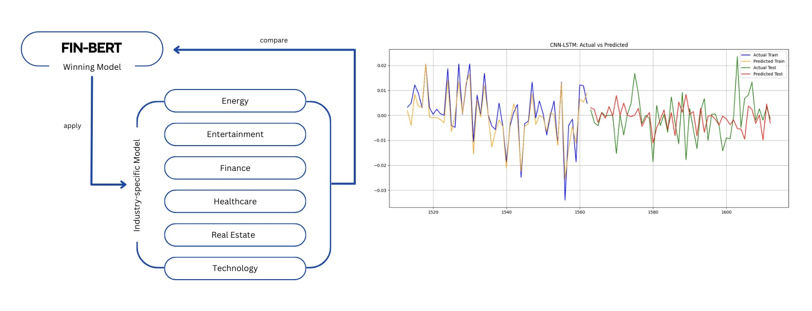
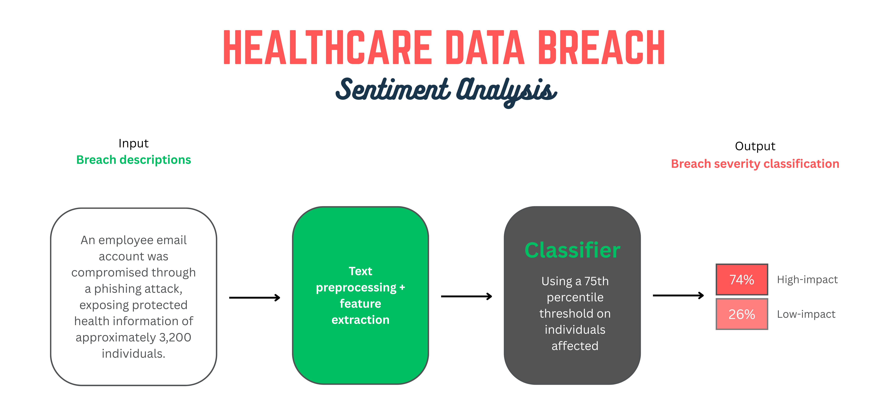

# Portfolio
---
### Digital Media Store Sales Analytics

My complete implementation of assignments and projects in [***Digital Media Store Sales Analytics***](https://github.com/kietngwork/chinook-sales-dashboard?tab=readme-ov-file).

Using **Erwin Data Modeler**, I designed a robust and normalized Entity-Relationship Diagram (ERD) to establish clean relationships and enforce data integrity. The modeled data was then used to develop an interactive **Power BI** dashboard that delivers actionable insights into:

- Sales performance and revenue trends
- Market dynamics across regions and media types
- Customer behavior, including purchasing patterns and engagement

---
### Hit Songs Analysis using Spotify Audio Features

My complete implementation of assignments and projects in [***Hit Songs Analysis using Spotify Audio Features***](https://github.com/kietngwork/spotify-hit-song-analysis/blob/main/spotify_analysis_full_project.pdf).

Using **Python**, the analysis begins by using libraries as **Numpy** and **Pandas** to collect, clean, and prepare data to ensure accuracy, consistency, and analytical readiness. Visualization libraries as **Seaborn** and **Matplotlib** then were used to identify key patterns, trends, and relationships within the data. The findings are ultimately interpreted and transformed into actionable insights that support informed musician decision-making.

---
### BigQuery-Based IMDb Data Analytics and ML

My complete implementation of assignments and projects in [***BigQuery-Based IMDb Data Analytics and ML***](https://github.com/kietngwork/imdb-big-data-analytics-ml/blob/main/IMDb_Final_Report.pdf).

We leverage **Google BigQuery** and **Google Cloud Platform** to process and analyze large-scale IMDb datasets, applying **XGBoost** and machine learning techniques to transform raw movie, cast, crew, and audience data into actionable, investment-focused insights.

We also built a simplified, Gemini-based model to illustrate how the prediction workflow operates:

---
### Bloomberg Financial News: Sentiment Analysis using AI

My complete implementation of assignments and projects in [***Bloomberg Financial News Sentiment Analysis***](https://github.com/kietngwork/financial-news-sentiment-analysis/blob/main/financial-news-sentiment-analysis.pdf).

**FinBERT-LSTM Model:** A 'winning' model over Textblob and BERT when it is applied to predict the movement of stock prices based on price tendancy of the whole market (including Finance, Healthcare, Technology, Energy, Real Estate and Entertainment) ([GitHub](https://github.com/kietngwork/financial-news-sentiment-analysis)).

The study compares:
- A **general sentiment approach** applied across industries  
- **Industry-specific sentiment analysis** to test whether customization improves results

---
### Proactive Data Breach Risk Management in Healthcare 

My complete implementation of assignments and projects in [***Proactive Data Breach Risk Management in Healthcare***](https://github.com/kietngwork/healthcare-data-breach-risk-nlp/blob/main/healthcare_data_breach_risk_management_NLP_report.pdf).

This project applies **text mining** and **natural language processing (NLP)** techniques to healthcare data breach reports to uncover hidden patterns, classify breach severity, and support proactive risk management strategies.

The workflow begins with cleaning and preprocessing unstructured text data from **5,370** healthcare breach reports, using **tokenization** and **lemmatization** to prepare the corpus for analysis. A **Logistic Regression** model is then implemented to predict breach severity based on the number of individuals affected. 

To deepen insight, advanced NLP methods including Named Entity Recognition **(NER)**, Latent Dirichlet Allocation **(LDA)**, and **BERTopic** modeling are applied to extract frequent entities such as Protected Health Information (PHI) and identify dominant themes including ransomware attacks and email-based vulnerabilities.

# Skill & Certifications
---
My work and training have focused on building practical analytical skills and industry-recognized certifications, outlined below.

- <a href="https://www.datacamp.com/certificate/DA0026428814346" target="_blank" rel="noopener noreferrer">
  Data Analyst – DataCamp (2024)
</a>

- <a href="https://github.com/kietngwork/portfolio/blob/master/certifications/CoStar.pdf" target="_blank" rel="noopener noreferrer">
  CoStar Commercial Real Estate Analytics – CoStar Group (2024)
</a>

- <a href="https://github.com/kietngwork/portfolio/blob/master/certifications/AIMMS.pdf" target="_blank" rel="noopener noreferrer">
  Modeling with AIMMS I – AIMMS (2025)
</a>

- <a href="https://github.com/kietngwork/portfolio/blob/master/certifications/Google.pdf" target="_blank" rel="noopener noreferrer">
  The Fundamentals of Digital Marketing – Google (2021)
</a>

